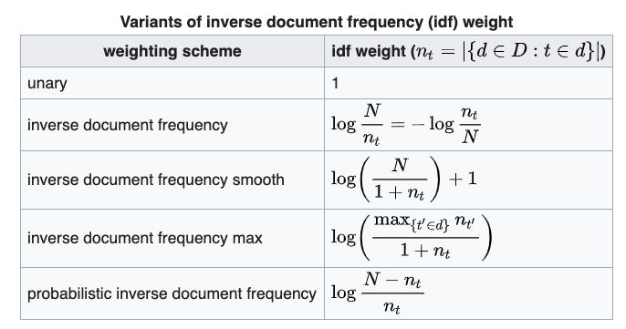
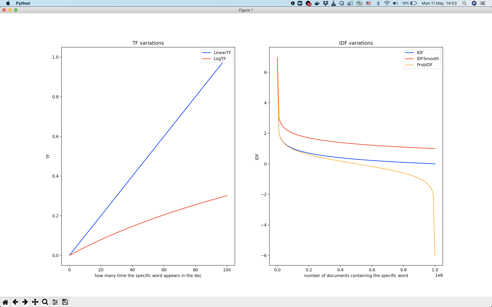
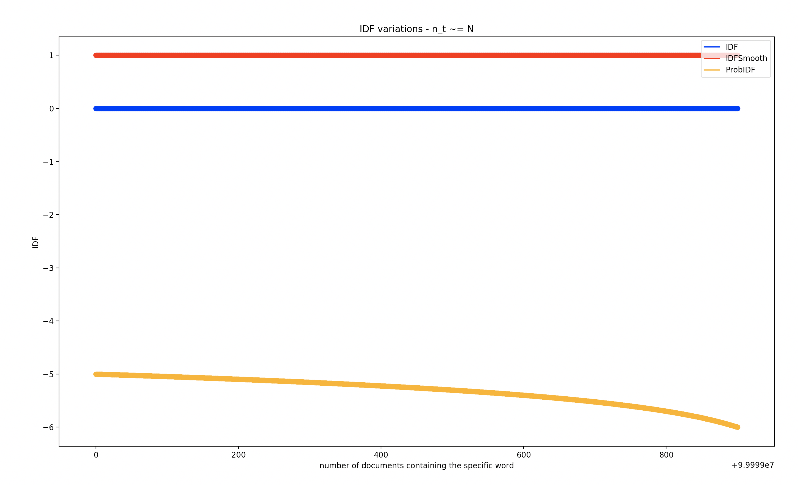

# tfidf-versions
## Description
This exercise purpose is to analyze 3 different variations of TF*IDF and get some insights and conclusions.
Specifically, I want to conclude when should we use each variation by showing the differences between them.

## Definitions
- n_t = number of documents containing the specific word
- N = total docs in corpus
- Wiki IDF variations
- 
    - I will use IDF, SmoothIDF, ProbIDF
    
    
## Conclusions
- It is enough to analyze TF & IDF behaviour separately to understand which variation is suited to each use-case.
- tf idf variations (code is here: [sim_tf_idf_variations.py](./tfidf/simulation/sim_tf_idf_variations.py))
 
- By observing the plots of 3 different IDF variations (right graph): 
    - We should use ProbIDF function when:
        - we want to penalize a term that occurs in more than 50% of document by giving it a negative weight.
        - For comparing between common words in the corpus (right side of the graph)
            - idf variations with high n_t (code is here: [sim_idf_high_n_t.py](./tfidf/simulation/sim_idf_high_n_t.py))
                - Notice, it's a zoom in on the right part of ""IDF Variations" graph.  
            
            - For example: for 2 words w1, w2 with n_t =~ N (appears in almost all docs in the corpus):
                - Assume w1_tf = w2_tf
                - When using IDF / SmoothIDF: w1_idf =~ w2_idf ---> w1_tfidf =~ w2_tfidf
                     - It is hard to tell the difference!
                - When using ProbIDF: w1_idf != w2_idf ---> w1_tfidf != w2_tfidf.
                    - you can tell the difference!
    - We should use a Smooth IDF when we do not want a bounded IDF value and not undefined (for n_t = 0) and 0 (for n_t = N) as such values ruins a function where IDF is multiplied with another scalar (the TF).
        - We don't want the words with an IDF score of zero to get suppressed entirely.
            - For example, in machine learning, when using tf-idf as a pre-processing step. The goal is to increase the weight of rare words and reduce the weight of high frequency function words (just reduce, not make it 0...).
    - For singular words (not in the corpus yet), don't use normal IDF (it's IDF could not be calculated, due to division by zero)
- By observing the plots of 2 different TF variations (left graph):
    - For giving more weight to the IDF part (of the TF*IDF formula) we can use the second variation of the TF formula (with the log).
    - ￿For giving more weight to the current document (emphasize the localization), we should use the linear variation of the TF formula.
    - In terms of raw tf, the measures will have a very high variance. That is why it is recommended use logarithm to normalize them. Log of tf seems to be the best practiced.

## Notes
- sklearn can be used for calculating tfidf (I avoided it here).
    - For a real world example, I will use it.        